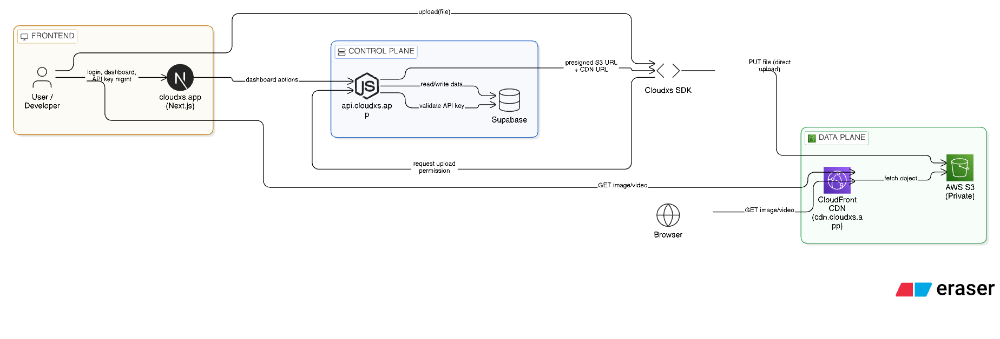

# CLOUDXS 


[Cloudxs](https://cloudxs.app) is a developer-first media upload and delivery platform that allows developers to securely upload images and videos and serve them globally via a CDN, without backend bottlenecks or file size limits.

It is designed using an industry-standard control-plane and data-plane architecture, similar to platforms like Cloudinary and Firebase Storage.

---

## Project Overview

Cloudxs provides:

- Secure API-key based uploads
- Direct uploads to cloud storage (no backend file handling)
- Global CDN delivery
- Simple SDK for developers
- Dashboard for users to manage API keys and uploaded data

---

## System Architecture

Cloudxs separates control and data responsibilities.  
The backend controls access and permissions, while the cloud infrastructure handles data storage and delivery.

### Architecture Diagram

Insert the Eraser.io architecture diagram image below:



---

## Architecture Breakdown

### 1. Frontend — `cloudxs.app`

Purpose: User-facing dashboard

- Built with Next.js
- User authentication and login
- API key creation and revocation
- Viewing uploaded images and videos
- Documentation and usage statistics

This layer is only for human interaction and never handles file uploads.

---

### 2. Backend (Control Plane) — `api.cloudxs.app`

Purpose: Security, rules, and orchestration

Responsibilities:
- Validate API keys
- Enforce upload rules and limits
- Generate presigned AWS S3 upload URLs
- Store file metadata in the database
- Return CDN URLs to clients

The backend does not:
- Receive file data
- Stream media
- Serve images or videos

---

### 3. Cloudxs SDK

Purpose: Developer experience

The SDK abstracts the entire upload process into a single function:

```js
await cloudxs.upload(file);
```

 - Internally, the SDK performs the following steps:

 - Requests upload permission from the Cloudxs backend

 - Receives a presigned S3 upload URL

 - Uploads the file directly to AWS S3

 - Returns the final CDN URL

This design provides a single, simple API for developers while remaining scalable and secure.

### 4. Data Plane (Storage and Delivery)

#### AWS S3 (Private Bucket)

 - Stores original images and videos

 - Bucket is private and not publicly accessible

 - Uploads are allowed only via short-lived presigned URLs

 - No direct access from browsers or users

#### CloudFront CDN — cdn.cloudxs.app

 - Global content delivery network

 - Serves media directly from the private S3 bucket

 - Backend is never involved in file delivery

 - Highly scalable and low-latency

#### Upload Flow (Step-by-Step)
```
User / Developer
      ↓
Cloudxs SDK
      ↓
api.cloudxs.app (API key validation)
      ↓
Presigned S3 URL returned
      ↓
Direct upload to AWS S3
      ↓
Media available via cdn.cloudxs.app
```

This flow removes backend load and avoids request size limitations such as the 10MB limit commonly found in server frameworks.

#### Why This Architecture Matters
##### Traditional Backend Uploads

 - Backend receives the full file

 - Limited by request body size

 - High memory and CPU usage

 - Expensive and difficult to scale

##### Cloudxs Architecture

 - Backend only controls permissions

 - Files are uploaded directly to cloud storage

 - CDN handles all media delivery

 - Cost-efficient and highly scalable

 - This architecture is used by modern, production-grade platforms.

##### Tech Stack
Layer	Technology
Frontend	Next.js
Backend	Node.js
Authentication & Database	Supabase
Storage	AWS S3
CDN	AWS CloudFront
SDK	JavaScript / TypeScript
Infrastructure	AWS

##### Security Design

 - API key based authentication

 - Private AWS S3 buckets

 - Time-limited presigned upload URLs

 - CDN access restricted through CloudFront

 - No public access to raw storage

##### Project Structure
```
cloudxs/
├── frontend/        # cloudxs.app (Next.js dashboard)
├── backend/         # api.cloudxs.app (Node.js control plane)
├── sdk/             # Cloudxs SDK
├── infrastructure/  # AWS and CloudFront configuration
└── docs/            # Architecture diagrams and documentation
```
##### Key Concepts Demonstrated

 - Control plane vs data plane separation

 - Secure direct-to-cloud uploads

 - CDN-first media delivery

 - API key based security model

 - SDK design for developer platforms

 - Scalable cloud infrastructure


## Author

### [Prathmesh Rajurkar](http://prathmeshrajurkar.tech/)
#### Full Stack / Cloud Engineer
#### India
